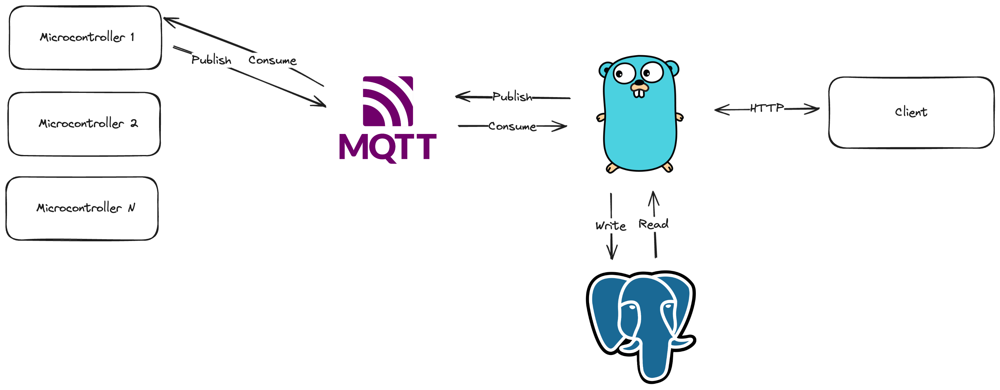

# Internet of Things Proof-of-concept (POC)

## What is This
This is a proof-of-concept project of smart farming IOT server app. The goals is to proof that it is feasible to build a server application to handle requests from microcontroller devices using event-driven architecture.

## Why We Build This
Since microcontroller has minimum resource and possibility of unstable connection to other device, we need to build an architecture that require minimum network transmition between microcontroller to server which will improve the stability and reliability of the both devices.

## High Level Architecture

## Technology Stacks
1. Golang as the server application
2. Eclipse-MQTT as the message broker
3. PostgreSQL as the persistent data storage

## How to develop
1. Clone this repository
2. Ask repository owner for the needed files (configuration and etc.)
2. For the first run, execute `./script/init-deps.sh` or `make init-deps`. This will run all dependencies 
3. Run `go run internal/*.go` or `make run`
4. Happy coding!